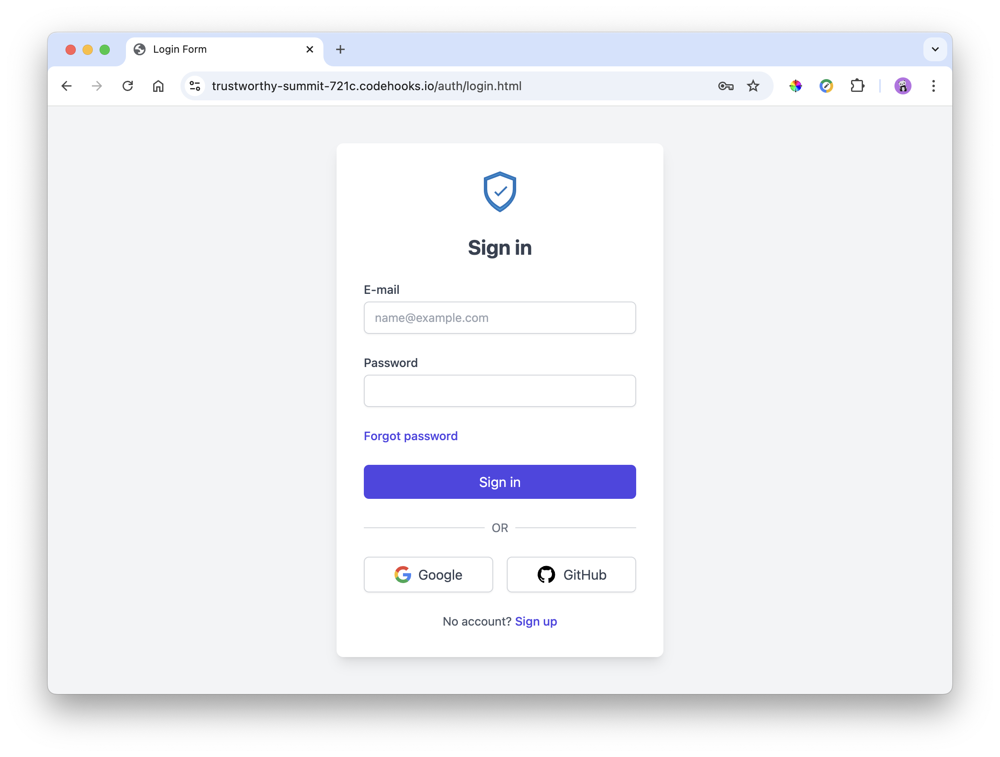
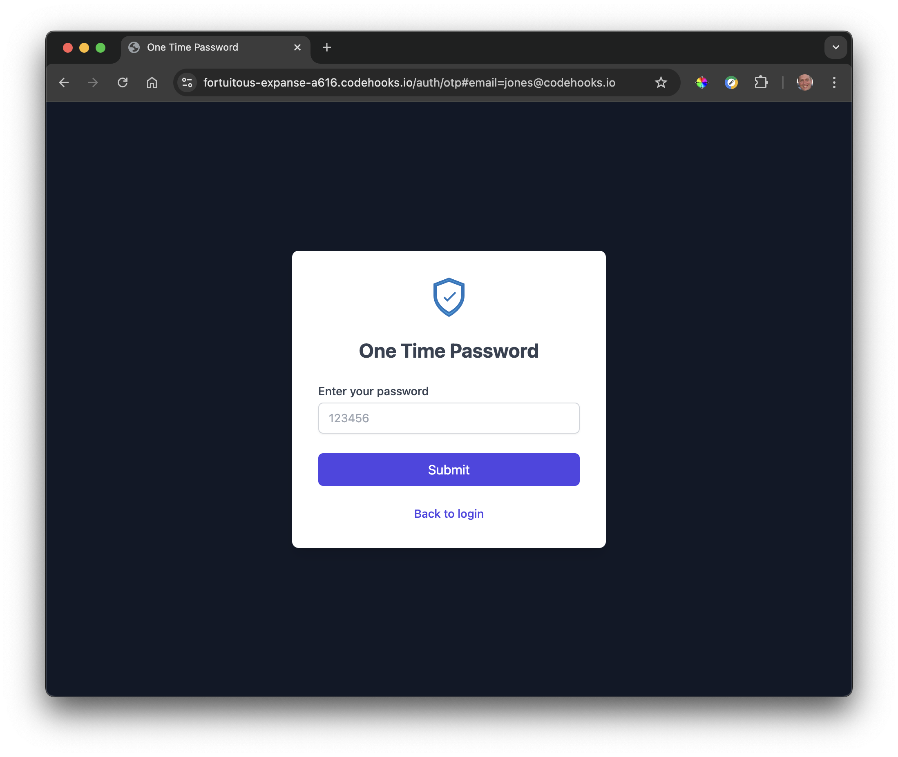
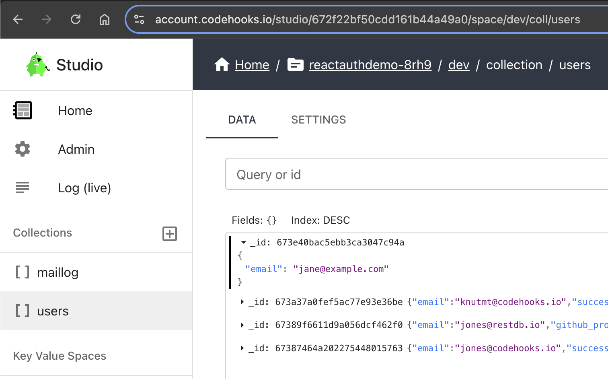

# codehooks-auth
Open source authentication library for Codehooks.io REST API backends. 

**codehooks-auth** is a library that provides easy-to-use authentication functionality for Codehooks.io REST API backends (and any client side web app). It supports various authentication methods, including one time password authentication and OAuth (Google and Github).

The **codehooks-auth** library aims to provide a simple and easy to use alternative for those who prefer not to use commercial providers or for those who need more control over the authentication process.

>Note: Codehooks.io also supports leading JWT based authentication providers like [Auth0.com](https://auth0.com) and [Clerk.com](https://clerk.com). 


## Features

- Easy integration with Codehooks.io apps
- Easy integration with any client side web app
- Support for one time password authentication
- OAuth support (Google and Github)
- JWT-based access and refresh tokens
- Customizable success and failure redirects
- Static asset serving for auth-related pages
- Configurable caching for static assets

Check out the React app [live demo example](https://fortuitous-expanse-a616.codehooks.io). Source code is available at Github [here](https://github.com/codehooks-io/codehooks-auth-example-react).

## Installation
To install codehooks-auth, use npm:

```bash
npm install codehooks-auth codehooks-js
```

The install script will create a folder in your project `/auth/assets` with the client side assets and JavaScript used by the lock screen. In addition, all handlebars templates are provided for optional customization. See the [Template Customization](#template-customization) section for more details.

```
auth/
└── assets/
    ├── emailTemplateOTP.hbs
    ├── emailTemplateOTPText.hbs
    ├── emailTemplateWelcome.hbs
    ├── emailTemplateWelcomeText.hbs
    ├── layout.hbs
    ├── login.hbs
    ├── otp.hbs
    ├── signup.hbs
    ├── favicon.ico
    ├── otp.js
    ├── signin.js
    └── styles.css
```

## Usage

Here's a complete example of how to use codehooks-auth in your Codehooks.io app:

```javascript
import {app} from 'codehooks-js'
import { initAuth } from 'codehooks-auth'

// setup your crudl api for /api/person
app.crudlify({person: {}}, {prefix: "/api"})

const settings = {
  JWT_ACCESS_TOKEN_SECRET: process.env.JWT_ACCESS_TOKEN_SECRET, // coho set-env JWT_ACCESS_TOKEN_SECRET 'xxx' --encrypted
  JWT_REFRESH_TOKEN_SECRET: process.env.JWT_REFRESH_TOKEN_SECRET, // coho set-env JWT_REFRESH_TOKEN_SECRET 'xxx' --encrypted
  redirectSuccessUrl: '/dashboard.html', // where to redirect after successful login
  baseAPIRoutes: '/api', // protected routes
  google: {
    CLIENT_ID: process.env.CLIENT_ID, // TODO: get this from google cloud console
    CLIENT_SECRET: process.env.CLIENT_SECRET, // TODO: get this from google cloud console
    REDIRECT_URI: 'https://{YOUR_APP_URL}.codehooks.io/auth/oauthcallback/google' // TODO: change this to your app url, add the callback url you set in google cloud console
  },
  github: {
    CLIENT_ID: process.env.GITHUB_CLIENT_ID, // TODO: get this from github
    CLIENT_SECRET: process.env.GITHUB_CLIENT_SECRET, // TODO: get this from github
    REDIRECT_URI: 'https://{YOUR_APP_URL}.codehooks.io/auth/oauthcallback/github' // TODO: change this to your app url, add the callback url you set in github
  },
  emailProvider: 'mailgun',
  emailSettings: {
    mailgun: {
      MAILGUN_APIKEY: process.env.MAILGUN_APIKEY, // TODO: get this from mailgun
      MAILGUN_DOMAIN: process.env.MAILGUN_DOMAIN, // TODO: get this from mailgun
      MAILGUN_FROM_EMAIL: process.env.MAILGUN_FROM_EMAIL, // TODO: set this to your email
      MAILGUN_FROM_NAME: process.env.MAILGUN_FROM_NAME // TODO: set this to your name
    }
  }
}
// setup auth settings
initAuth(app, settings)

// bind to serverless runtime
export default app.init(()=>{
  console.log('Look Mummy, I have my own authenticated app!')
})
```

## Deployment of the server side code

The easiest way to deploy your app with codehooks-auth is to use the `codehooks-cli` tool. This will deploy your code with the auth bindings and setup the environment variables for you.


```bash
coho deploy
```

## Client web app

Client web apps can use the codehooks-auth package to login and signup. To authenticate your users, direct them to the client web app route `https://{YOUR-APP}.codehooks.io/auth/login`.

The screenshot below shows the lock screen presented to the users.



The screenshot below shows the one time password screen presented to the users.



If your app `redirectSuccessUrl` is `https://example.com/dashboard` then after login you will be redirected to this URL. And, a httpOnly cookie will be set with the access_token and a refresh_token. This makes it very simple to call your Codehooks.io API.

Call your Codehooks.io API with the implicit access_token in the url hash or the httpOnly cookie.

```javascript
fetch('/api/person', {
  credentials: "include",
  headers: {
    'Content-Type': 'application/json'
  }
});
```

_ToDo: Provide a complete client side JavaScript that handles access token, and refresh token when the access token expires._

## Manage your users

You can manage your users with the codehooks-cli tool or the web ui. 

The easiest way to get started is to add a user with the Studio app as shown in the screenshot below.

> Note: Add a property `"active": true` or `"active": false` to set a user as _active_ or _inactive_.



## Configuration

The `settings` object allows you to configure various aspects of the authentication process:

### Core Settings
- Type: `AuthSettings`
- Default configuration:
```javascript
{
    baseUrl: 'https://{YOUR_APP_URL}.codehooks.io', // Or, your app's base URL https://example.com
    userCollection: 'users', // Database collection for users
    JWT_ACCESS_TOKEN_SECRET: process.env.JWT_ACCESS_TOKEN_SECRET,
    JWT_ACCESS_TOKEN_SECRET_EXPIRE: '15m',
    JWT_REFRESH_TOKEN_SECRET: process.env.JWT_REFRESH_TOKEN_SECRET,
    JWT_REFRESH_TOKEN_SECRET_EXPIRE: '8d',
    redirectSuccessUrl: '/',
    redirectFailUrl: '/',
    useCookie: true,
    baseAPIRoutes: '/',
    defaultUserActive: false, // Whether new users are active by default
    emailProvider: 'none',
    labels: {
        signinTitle: 'Sign in',
        signupTitle: 'Sign up',
        forgotTitle: 'Forgot password',
        otpTitle: 'OTP'
    }
}
```

### Event Hooks
The library provides several event hooks that allow you to customize the authentication flow:

```javascript
{
    // Called after successful login attempt
    onLoginUser: async (req, res, data) => {
        const { access_token, user } = data;        
        return new Promise((resolve, reject) => {          
          // Custom login logic here
          // Call resolve() to allow login
          resolve();
        });
    },

    // Called after successful signup attempt
    onSignupUser: async (req, res, data) => {
        const { access_token, user } = data;        
        return new Promise((resolve, reject) => {          
          // Custom signup logic here
          // Call reject() to prevent signup
          reject('User not allowed to signup');
        });
    },

    // Hook for customizing static asset serving
    staticHook: (req, res, next) => {
        // Add custom headers or logic for static assets
        res.setHeader('Cache-Control', 'public, max-age=31536000');
        res.removeHeader('Pragma');
        res.removeHeader('Surrogate-Control');
        next();
    }
}
```

#### Example: Restricting Login Access
Here's an example of using `onLoginUser` to restrict login access to specific email domains:

```javascript
const settings = {
    onLoginUser: async (req, res, data) => {
        const { user } = data;
        const allowedEmails = ['jane@example.com', 'joe@example.com']; // Add your allowed emails here

        return new Promise((resolve, reject) => {
          if (!allowedEmails.includes(user.email)) {
            console.error('User not allowed to login');
            reject('User not allowed to login');
          }
          resolve();
        });
    }
}
```

#### Example: Adding Custom User Data on Signup
Here's an example of using `onSignupUser` to add additional user data:

```javascript
const settings = {
    onSignupUser: async (req, res, data) => {
        const { user } = data;
        const db = await Datastore.open();
        
        // Add custom user data
        await db.updateOne('users', 
            { email: user.email },
            { 
                $set: { 
                    role: 'user',
                    organization: 'default',
                    createdAt: new Date().toISOString()
                }
            }
        );
    }
}
```

#### Example: Custom Cache Headers
Here's an example of using `staticHook` to add custom cache headers for static assets:

```javascript
const settings = {
    staticHook: (req, res, next) => {
        // Add cache headers for static assets
        res.setHeader('Cache-Control', 'public, max-age=31536000');
        res.setHeader('X-Frame-Options', 'DENY');
        res.setHeader('X-Content-Type-Options', 'nosniff');
        next();
    }
}
```

### Email Configuration
The library supports multiple email providers for sending authentication-related emails (like OTP codes and welcome emails). Currently supported providers are:

- Mailgun
- Postmark
- SendGrid (coming soon)

Configure your email provider in the settings:

```javascript
{
    emailProvider: 'mailgun', // 'mailgun' | 'postmark' | 'sendgrid' | 'none'
    emailSettings: {
        mailgun: {
            MAILGUN_APIKEY: process.env.MAILGUN_APIKEY,
            MAILGUN_DOMAIN: process.env.MAILGUN_DOMAIN,
            MAILGUN_FROM_EMAIL: process.env.MAILGUN_FROM_EMAIL,
            MAILGUN_FROM_NAME: process.env.MAILGUN_FROM_NAME
        }
        /*
        postmark: {
            POSTMARK_APIKEY: process.env.POSTMARK_APIKEY,
            POSTMARK_FROM_EMAIL: 'jones@codehooks.io',
            POSTMARK_FROM_NAME: 'Coho man'
        }*/
    },
    // Customize email content
    emailSignupData: {
        subject: 'Welcome to Example',
        title: 'Welcome to Example',
        productName: 'Example',
        productUrl: 'https://example.com',
        companyName: 'Example',
        companyAddress: '123 Main St',
        companySuite: '12345',
        support_email: 'support@example.com',
        live_chat_url: 'https://example.com/chat',
        help_url: 'https://example.com/help',
        login_url: 'https://example.com/login',
        senderName: 'Example Team'
    },
    emailOTPData: {
        // Same fields as emailSignupData for OTP emails
    }
}
```

### Template Customization
The library uses Handlebars templates for all authentication pages and emails. You can customize these templates in two ways:

1. **Edit the Default Templates**
   After installation, the default templates are automatically copied to your project's `/auth/assets` directory:
   ```
   auth/assets/
   ├── emailTemplateOTP.hbs         # OTP email (HTML)
   ├── emailTemplateOTPText.hbs     # OTP email (plain text)
   ├── emailTemplateWelcome.hbs     # Welcome email (HTML)
   ├── emailTemplateWelcomeText.hbs # Welcome email (plain text)
   ├── layout.hbs                   # Main layout template
   ├── login.hbs                    # Login page
   ├── otp.hbs                      # OTP verification page
   ├── signup.hbs                   # Signup page
   ├── favicon.ico                  # Favicon
   ├── otp.js                      # OTP page JavaScript
   ├── signin.js                   # Login/Signup page JavaScript  
   └── styles.css                  # Shared styles
   ```

2. **Override Templates Programmatically**
   You can override specific templates by providing custom template loader functions in your settings:

   ```javascript
   import handlebars from 'handlebars';
   
   const settings = {
     templateLoaders: {
       // Override just the templates you want to customize
       login: () => handlebars.compile(require('./custom/login.hbs')),
       emailTemplateWelcome: () => handlebars.compile(require('./custom/welcome.hbs'))
     }
   };
   ```

   Available template override options:
   - `layout`: Main layout template
   - `login`: Login page
   - `otp`: OTP verification page  
   - `signup`: Signup page
   - `emailTemplateWelcome`: Welcome email (HTML)
   - `emailTemplateWelcomeText`: Welcome email (plain text)
   - `emailTemplateOTP`: OTP email (HTML)
   - `emailTemplateOTPText`: OTP email (plain text)

### OAuth Configuration
For social login support:

```javascript
{
    google: {
        CLIENT_ID: process.env.CLIENT_ID,
        CLIENT_SECRET: process.env.CLIENT_SECRET,
        REDIRECT_URI: 'https://{YOUR_APP_URL}.codehooks.io/auth/oauthcallback/google',
        SCOPE: ['email', 'profile'] // Optional
    },
    github: {
        CLIENT_ID: process.env.GITHUB_CLIENT_ID,
        CLIENT_SECRET: process.env.GITHUB_CLIENT_SECRET,
        REDIRECT_URI: 'https://{YOUR_APP_URL}.codehooks.io/auth/oauthcallback/github',
        SCOPE: ['user:email'] // Optional
    }
}
```

#### GitHub Setup

1. Go to https://github.com/settings/developers
2. Click "New OAuth App"
3. Fill in the application details:
   - Application name: [Your App Name]
   - Homepage URL: http://localhost:3000 (for development)
   - Authorization callback URL: http://localhost:3000/api/auth/callback/github

Save your Client ID and Client Secret for later configuration.

#### Google Setup

1. Go to https://console.cloud.google.com/
2. Create a new project or select an existing one
3. Navigate to "APIs & Services" > "Credentials"
4. Click "Configure Consent Screen"
   - Select "External" user type
   - Fill in required app information (name, email, etc.)
   - Add necessary scopes (typically email and profile)
   - Add test users if needed
5. Return to Credentials page and click "Create Credentials" > "OAuth 2.0 Client ID"
   - Application type: Web application
   - Name: [Your App Name]
   - Authorized JavaScript origins: http://localhost:3000 or your app url
   - Authorized redirect URIs: http://localhost:3000/api/auth/callback/google or your app url
6. Click "Create"

Save your Client ID and Client Secret for later configuration.

### Authentication API Routes
These are the routes automatically created by the `initAuth` function:

#### Core Auth Routes
- `/auth/login` - Main login page (GET)
- `/auth/signup` - Signup page (GET)
- `/auth/logout` - Logout endpoint, clears auth cookies (GET)
- `/auth/accesstoken` - Get JWT from access token (POST)
- `/auth/refreshtoken` - Refresh expired access token (POST)
- `/auth/activate/:token` - Account activation endpoint (GET)
- `/auth/forgot` - Forgot password page (GET) (Currently returns "Not implemented")

#### OTP (One-Time Password) Routes
- `/auth/otp` - OTP login page (GET)
- `/auth/otp` - Send OTP code (POST)
- `/auth/otp/verify` - Verify OTP code (POST)

#### OAuth Routes
When configured, the following OAuth routes are available:

Google:
- `/auth/login/google` - Initiate Google OAuth login
- `/auth/signup/google` - Initiate Google OAuth signup
- `/auth/oauthcallback/google` - Google OAuth callback

GitHub:
- `/auth/login/github` - Initiate GitHub OAuth login
- `/auth/signup/github` - Initiate GitHub OAuth signup  
- `/auth/oauthcallback/github` - GitHub OAuth callback

#### Static Assets
- `/auth/*` - Serves static assets for auth-related files from the `/auth/assets` directory

## Refresh Token

The refresh token is used to get a new access token when the current access token expires. The refresh token is stored in a httpOnly cookie.

Call the `/auth/refresh` endpoint with the refresh token in the httpOnly cookie to get a new access token.

```javascript
const response = await fetch('https://{YOUR_APP_URL}.codehooks.io/auth/refreshtoken', {
    method: 'POST',
    credentials: "include",
    headers: { 
        'Content-Type': 'application/json' 
    }
});
if (!response.ok) {
    throw new Error(`HTTP error! status: ${response.status}`);
}
const result = await response.json()
console.log('new access token', result.access_token);
```


## Security Note

Always keep your JWT secrets and OAuth client secrets secure. Use environment variables for sensitive information in production.


